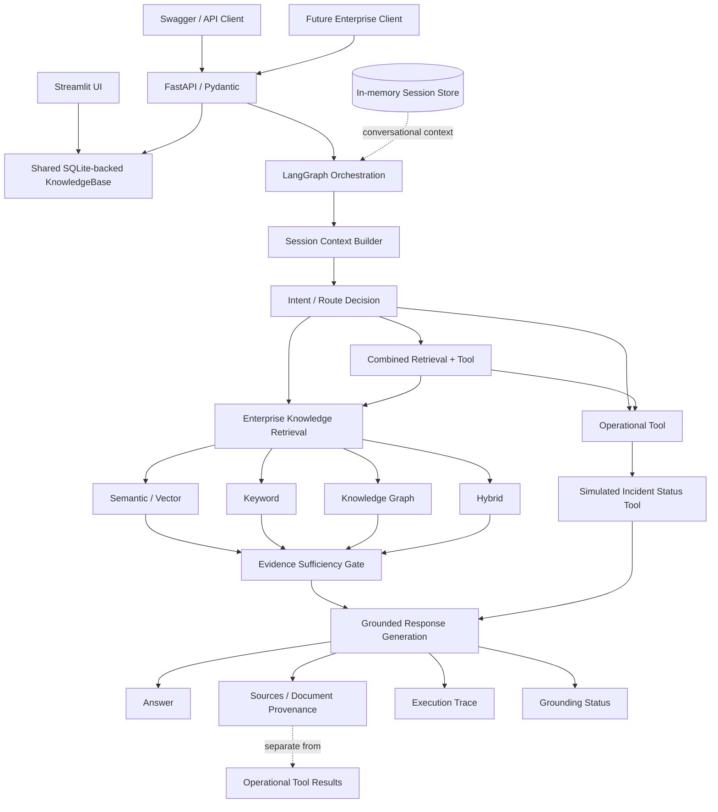

# Enterprise Knowledge Copilot

## Overview

Enterprise knowledge is distributed across architecture documents, API specifications, deployment guides, incident reports, risk registers, UAT material, and other internal sources. Finding an answer is only useful when the answer is grounded in evidence, explainable, and safe when the evidence is missing.

Enterprise Knowledge Copilot evolved from a local RAG prototype into an agentic enterprise knowledge architecture. It combines deterministic retrieval, a knowledge graph, LangGraph orchestration, bounded conversational context, explicit operational tool routing, and traceable responses. The current implementation is a portfolio/demo architecture with production-oriented engineering practices, not a production deployment.

## Key Capabilities

- Semantic/vector retrieval with a local sentence-transformers backend and deterministic NumPy fallback
- Keyword retrieval over section-aware document chunks
- Knowledge graph retrieval over explicit entity relationships
- Hybrid semantic plus graph retrieval
- Deterministic query routing
- Evidence sufficiency gating
- Grounded answer generation in local demo mode, with optional OpenAI generation support
- Explicit insufficient-evidence refusal
- Source and document provenance
- Concise execution traces
- LangGraph state, nodes, edges, and conditional edges
- FastAPI service with Pydantic request/response validation
- In-memory conversational session management
- Contextual follow-up resolution with session isolation
- Explicit operational tool routing
- Retrieval-only, tool-only, and combined retrieval-plus-tool workflows
- Streamlit demo compatibility
- Automated regression, retrieval, API, session, and tool tests
- Docker configuration for the FastAPI service
- GitHub Actions CI with test and Docker build validation

## Architecture



Document retrieval produces evidence items linked to source document, section, chunk, and optional graph relationship metadata. Operational tool results are simulated operational records and are deliberately kept separate from document provenance.

## Example Agent Behaviors

### Knowledge retrieval

Question:

```text
What is the impact of Kubernetes capacity during OCR batch peaks?
```

The agent routes to enterprise retrieval, retrieves document evidence, applies the evidence gate, and returns a grounded answer with sources and trace information.

### Operational tool

Question:

```text
What is the current status of INC-001?
```

The agent routes to `get_incident_status`, returning deterministic simulated operational data such as status, severity, owner, last update, and current action. This record is not document provenance.

### Combined workflow

Question:

```text
What caused INC-001 and what is its current status?
```

The agent performs enterprise knowledge retrieval for the cause and calls the simulated incident status tool for current operational data. The response and execution trace identify both sources.

### Contextual follow-up

```text
Turn 1: What is the impact of Kubernetes capacity during OCR batch peaks?
Turn 2: Who owns that risk?
```

The second turn can use the same session's compact topic, entity, graph-neighbor, incident-reference, and evidence-reference context to resolve the follow-up. A new session asking only `Who owns that risk?` does not inherit the first session's context and must not guess from another session.

## Grounding and Hallucination Control

- Conversation context helps interpret an unresolved question; it is not authoritative enterprise evidence.
- Newly retrieved document chunks support factual knowledge answers.
- The evidence sufficiency gate can refuse unsupported or incomplete answers.
- Unknown incidents do not produce fabricated operational records.
- Operational tool results are authoritative only within this simulated operational system and remain distinct from document provenance.
- Follow-up context can broaden retrieval recall, but it does not bypass evidence checks.

## API

Start the service locally from the repository root:

```powershell
.\.venv\Scripts\python.exe -m uvicorn backend.api:app --reload
```

The API listens on `http://127.0.0.1:8000`. Interactive documentation is available at `http://127.0.0.1:8000/docs`.

### `GET /health`

Returns a simple service status:

```json
{
  "status": "ok",
  "service": "enterprise-knowledge-copilot"
}
```

### `POST /query`

Request:

```json
{
  "question": "What is the current status of INC-001?",
  "session_id": "demo-session-001"
}
```

Abbreviated response:

```json
{
  "answer": "Simulated operational data for INC-001: OCR Service is Mitigated ...",
  "selected_retrieval_route": "incident_status_tool",
  "evidence_sufficient": true,
  "grounding_status": "Operational data",
  "sources": [],
  "provenance": [],
  "execution_trace": {
    "tool_decisions": [{"tool": "incident_status_tool", "reason": "..."}],
    "tool_executions": [{
      "tool": "get_incident_status",
      "input": "INC-001",
      "status": "found",
      "source": "simulated operational data"
    }]
  },
  "session_id": "demo-session-001",
  "operational_data": [{"incident_id": "INC-001", "status": "Mitigated"}]
}
```

For knowledge-retrieval requests, `provenance` contains retrieved document evidence and `operational_data` is empty. For unknown incidents, the API returns an insufficient-evidence response without an operational record.

## Testing

The current repository test suite has **65 passing tests**, including nine Phase 1 persistence tests. The suite covers:

- Document ingestion and metadata preservation
- Keyword, semantic, graph, and hybrid retrieval
- Retrieval evaluation metrics
- Grounded answer generation and refusal behavior
- Knowledge graph construction, paths, relationships, and provenance
- LangGraph routing, state, conditional edges, and equivalence behavior
- FastAPI health, query validation, provenance, and trace serialization
- In-memory session context, contextual follow-ups, and session isolation
- Retrieval-only, tool-only, combined, unknown-incident, and operational follow-up workflows
- Regression behavior across the existing application

Run the complete suite with:

```powershell
.\.venv\Scripts\python.exe -m pytest -q
```

## Docker

The production-oriented FastAPI image uses `python:3.12-slim`, installs `requirements.txt`, copies only the backend and required sample data, exposes port `8000`, and runs Uvicorn. It includes a health check against `/health`.

Build the image:

```powershell
docker build -t enterprise-knowledge-copilot-api .
```

Run the container:

```powershell
docker run --rm -p 8000:8000 enterprise-knowledge-copilot-api
```

Docker was not available in the local development environment, so a local image build and container health check were not executed. The GitHub Actions hosted runner performs Docker build validation after the test job.

## CI/CD

The workflow in `.github/workflows/ci.yml` runs on every push and pull request. It:

1. Checks out the repository.
2. Sets up Python 3.12.
3. Installs `requirements-dev.txt`.
4. Runs the complete pytest suite.
5. Builds the Docker image.

It validates the project but does not deploy it.

## Technology Stack

- Python 3.12 container/runtime target
- Streamlit for the existing demo UI
- FastAPI and Uvicorn for the API service
- Pydantic for typed request/response models
- LangGraph for explicit orchestration
- NumPy and optional sentence-transformers for semantic retrieval
- NetworkX for the in-memory knowledge graph
- PyVis for graph visualization
- OpenAI Python SDK for optional OpenAI answer generation
- Pytest for automated testing
- Docker and GitHub Actions for reproducible execution and CI validation

## Project Status / Limitations

This is a portfolio/demo architecture, not a production deployment.

- The operational incident service uses deterministic simulated data only.
- Session state is process-local and in-memory.
- The vector index and graph are in-memory.
- There is no production authentication or authorization.
- There is no Redis or external session persistence.
- There is no real enterprise operational API integration yet.
- Sample enterprise documents seed the knowledge base; uploaded Markdown and version history persist in SQLite.
- Local Docker execution was not available during validation.

## Future Production Evolution

Reasonable next steps include:

- Persistent and distributed session storage
- Authentication and authorization
- Secrets management
- Structured observability and tracing
- Real enterprise operational API integrations
- Cloud deployment
- Scalability, reliability, and access-control-aware retrieval

## Design Principles

1. Ground answers in evidence.
2. Know when not to answer.
3. Use conversational context to interpret questions, not as enterprise truth.
4. Route to the right capability instead of forcing every query through RAG.
5. Keep execution explainable and testable.

## Phase 1: persistent knowledge lifecycle

Streamlit and FastAPI use the same SQLite-backed KnowledgeBase service configuration.
They retain separate in-process indexes, refreshed from the committed database revision.
Documents, UUIDs, content hashes, version history, active versions, and the knowledge
revision persist. Chunks, vectors, and the NetworkX graph are rebuilt at startup or
when another process commits a change; derived artifacts are not stored on disk.

Set `KNOWLEDGE_STORE_DIR` to the same absolute local directory in both processes.
The default is `%LOCALAPPDATA%/EnterpriseKnowledgeCopilot` on Windows, or
`~/.local/share/EnterpriseKnowledgeCopilot` when LOCALAPPDATA is absent.
Avoid OneDrive/network filesystems for SQLite storage. Both applications default to
`KNOWLEDGE_EMBEDDING_BACKEND=hash`. Set it to `sentence-transformers` in both
processes to use the existing learned model; unavailable models fail clearly.
No new dependencies are required.

Same filename and identical UTF-8 content is a no-op. Changed content retains the
UUID and creates the next version. Sample seeding adds only missing filenames and
never overwrites persisted updates. In-memory `KnowledgeBase()` remains available.
Persistent changes build indexes before transaction commit; failures roll back.
Use `KnowledgeBase.snapshot()` to refresh and obtain coherent retrieval objects.

### Demonstrate persistence (PowerShell)

Run from the repository root. Set these variables in each terminal:

```powershell
$env:KNOWLEDGE_STORE_DIR = "$env:LOCALAPPDATA\EnterpriseKnowledgeCopilot"
$env:KNOWLEDGE_EMBEDDING_BACKEND = "hash"
.\.venv\Scripts\python.exe -m streamlit run app.py
```

Upload a UTF-8 Markdown file in Document Library, then ask about its contents.
In a second terminal with the same variables:

```powershell
.\.venv\Scripts\python.exe -m uvicorn backend.api:app --host 127.0.0.1 --port 8000
Invoke-RestMethod -Uri http://127.0.0.1:8000/query -Method Post -ContentType 'application/json' -Body '{"question":"What protocol does Cobalt Relay use?"}'
```

Example upload text:

```markdown
# Cobalt Relay
Cobalt Relay uses the Quartz Lattice protocol to replicate the archive every 17 minutes.
```

Stop both processes with Ctrl+C and restart with the same commands. Query again
without re-uploading: the uploaded source remains available. Re-uploading identical
content leaves its version unchanged; changing the text creates version 2.
Inspect identities and versions:

```powershell
.\.venv\Scripts\python.exe -c "from backend.knowledge_base import create_shared_knowledge_base; k=create_shared_knowledge_base(); print('revision', k.revision); print([(d.name,d.metadata['document_id'],d.metadata['version']) for d in k.documents])"
```

For containers mount a local directory at `/knowledge` and set
`KNOWLEDGE_STORE_DIR=/knowledge` (for example `docker run --rm -p 8000:8000
--mount type=bind,source=/absolute/local/knowledge,target=/knowledge
-e KNOWLEDGE_STORE_DIR=/knowledge enterprise-knowledge-copilot-api`).
The host UI must point to that same host directory.

Limitations: full-corpus rebuilds, one-host local storage, serialized writes, no
version retention cleanup or document deletion, and unchanged in-memory sessions.
